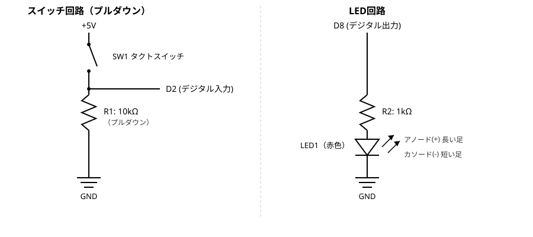
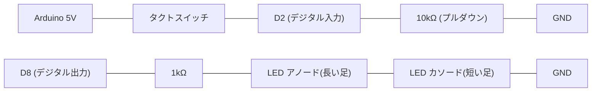
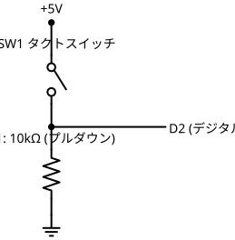
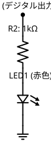

# プログラム② 単純なタクトスイッチとLED

## 概要

タクトスイッチの入力をArduino Unoのデジタル入力ピンで読み取り、LEDの点灯をデジタル出力ピンで制御する。最もシンプルな挙動として、**スイッチを押している間だけLEDが点灯する**構成とする。

チャタリング対策は現時点では行わず、実機で不具合（誤点滅等）が観測された場合に対応する方針（2026-08-30、ユーザー確認済み）。

## 電気工作

配線・ブレッドボード組み立てはユーザーが行う。以下はClaudeが作成した回路設計。

### 使用部品

| 部品 | 数量 | 備考 |
|---|---|---|
| タクトスイッチ | 1個 | キット付属 |
| LED（赤色） | 1個 | キット付属3色（赤・白・緑）のうち赤を使用。理由: 白・緑はInGaN系で順方向電圧の個体差が大きく、赤は比較的安定しているため |
| タクトスイッチ用抵抗（プルダウン） | 1本（10kΩ、茶黒橙金） | キット付属 |
| LED用抵抗 | 1本（1kΩ、茶黒赤金） | キット付属。`docs/overview.md`備考の「付属LEDは1kΩ抵抗で点灯確認済み」の実績に合わせて選定 |

### ピン割り当て

| ピン | 用途 |
|---|---|
| D2 | スイッチ状態のデジタル入力 |
| D8 | LED点灯のデジタル出力 |

### 回路図

第一候補はSVG（抵抗のジグザグ記号・LEDのダイオード記号（発光矢印付き）・スイッチ記号など、電気回路になじみのある記法）。あわせてmermaid版も残す（回路が複雑になるとSVGは座標調整コストが増すため、その場合の代替・補助として維持。方針は[プロジェクトCLAUDE.md](../../CLAUDE.md)参照）。ASCIIアートは可読性の観点で不採用。

- スイッチ回路: プルダウン方式。押していないときD2はLOW、押しているときD2はHIGHになる。
- LED回路: D8をHIGHにするとLED点灯、LOWで消灯。アノード（長い足）を抵抗側、カソード（短い足）をGND側に接続する。

#### SVG版（第一候補）

ヘッドレスブラウザでのレンダリングにより視認性確認済み（2026-08-30）。



ファイル: `programs/02_switch_led/circuit_diagram.svg`

#### mermaid版（補助）



#### 比較用トライアル: schemdraw（Python自動生成、2026-08-30）

`schemdraw`（`py -3.11 -m pip install schemdraw`でユーザーサイトパッケージに導入。プロジェクトの依存関係には未追加）というPythonライブラリで自動生成した版。回路が複雑になった場合のSVG手動調整コストを懸念する声を受け、比較のために試作した。





生成スクリプト: `programs/02_switch_led/generate_schemdraw_diagram.py`（`schemdraw.use('svg')`でSVGネイティブバックエンドを指定。matplotlibバックエンド（デフォルト）だと日本語ラベルの文字化けが発生したため）

**評価（4回チューニングして到達した所感）**

- 長所: 抵抗のジグザグ・スイッチの開閉記号・LEDのダイオード+発光矢印記号など、部品記号自体は完全自動生成され標準的な見た目になる。部品を追加する配線もコードを1行足すだけで済み、回路が複雑になったときの座標計算コストは手描きSVGより低いと見込める。
- 短所: 日本語の複数行ラベルの自動配置に癖があり、素の状態では隣接ラベルと重なる。分岐点やGND接続点の前に空の配線（スペーサー）を挟むことでほぼ解消できたが、キャンバス最左端に接するラベル（例: `D8 (デジタル出力)`の先頭の括弧）は現時点でも数ピクセル欠ける問題が残っている。
- 結論: ラベル配置は依然として一定のチューニングが必要で、「複雑な回路でのコスト増」への対策として万能ではないが、部品記号の自動生成という点では手描きSVGの負担を軽減できる。
- 見た目の差（手描きSVGの方が視認性が高い）は、ツールの上限ではなく、レイアウトとラベルを一体設計する視認性への配慮をどれだけ作り込んだかの差によるところが大きいと考察した。schemdraw側は重なり解消までしか詰めておらず、色分けによる情報の階層化（補足文字をグレーにする等）も未着手。
- 現時点の結論（2026-08-30）: **SVG（手描き）を第一候補として維持**。schemdrawは今後、回路が複雑化しSVGの座標調整コストが実際に問題になった際の改善候補として保持する（採用は保留、破棄はしない）。

### 電圧・電流計算（オームの法則）

**LED回路**

- Arduino出力HIGH: 約5V
- 赤色LED順方向電圧 Vf: 一般的な値として1.8〜2.2V（実測値ではなく一般的な範囲での見積もり）
- 電流 I = (5V − Vf) / 1kΩ
  - Vf = 1.8V の場合: I ≈ 3.2mA
  - Vf = 2.2V の場合: I ≈ 2.8mA
- ATmega328Pのデジタルピン許容電流（推奨20mA、絶対最大40mA）に対し十分小さく、安全マージンは大きい。既に1kΩ抵抗での点灯が実機で確認済みのため、輝度も実用上問題ないと判断。

**スイッチ回路（プルダウン抵抗）**

- 押下時の電流: I = 5V / 10kΩ = 0.5mA（デジタル入力のプルダウン電流として妥当な範囲）

## 動作仕様

- `D2`（スイッチ入力）の状態をそのまま`D8`（LED出力）へ出力する。プルダウン回路のため、スイッチを押している間`D2`はHIGH→LED点灯、離すとLOW→消灯。
- チャタリング対策は行わない（前述の方針どおり）。

## ファイル構成

```
programs/02_switch_led/
├── README.md                            本ドキュメント
├── platformio.ini                       PlatformIO設定（ボード: uno、書き込み先: COM3）
├── src/main.cpp                         本体プログラム
├── circuit_diagram.svg                  回路図（手描きSVG・第一候補）
├── circuit_diagram_schemdraw_switch.svg 回路図（schemdraw生成・スイッチ回路、比較用）
├── circuit_diagram_schemdraw_led.svg    回路図（schemdraw生成・LED回路、比較用）
└── generate_schemdraw_diagram.py        上記schemdraw版の生成スクリプト
```

## ビルド・書き込み・動作確認手順

前提: VS Code + PlatformIO IDE拡張機能がインストール済みであること。回路設計（部品・ピン割り当て・電圧電流計算）は上記「電気工作」参照。実際の配線・ブレッドボード組み立てはユーザーが行う。

1. 上記回路設計に沿って配線する。
2. VS Code で `programs/02_switch_led/` フォルダを開く（PlatformIOプロジェクトとして認識される）。
3. Arduino Uno をUSBケーブルでPCに接続する。
4. PlatformIOのUploadボタン（→アイコン）でビルド・書き込みを実行する。
   - CLIの場合: `pio run --target upload`
5. スイッチを押している間だけLEDが点灯することを確認する。

## 接続ポートについて

`platformio.ini` の `upload_port` は、プログラム①での動作確認時の実績（COM3）を暫定値として設定している。USBポートの差し替えやPC再起動などによりCOM番号が変わった場合は、実際のポート番号に書き換える必要がある（確認方法: `pio device list`）。

## 動作確認結果

ビルドは確認済み（2026-08-30、`pio run`で成功）。実機での書き込み・スイッチ/LED動作確認は配線完了後に実施する。
