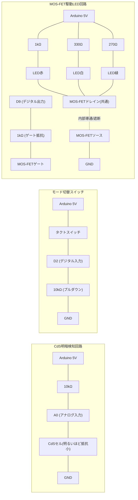

# プログラム③ 明暗検知ナイトライト（お任せ企画）

## 概要

「お任せ」の位置づけとして、②までで未使用だったCdSセル・MOS-FET・LED（白・緑）を使い、周囲が暗くなると自動でLEDが点灯する簡易ナイトライトを製作する。タクトスイッチで動作モードを「自動／常時点灯／消灯」の3状態に切り替えられるようにし、②で実証済みの時間ベースデバウンス処理を流用する。

方針は事前にユーザーへ提案し確認済み（2026-08-30）:

- CdS＋MOS-FETを軸にした明暗検知ナイトライトの方向で進める（承認）。
- キット付属のダイオードは、③では**使用しない**（承認）。理由は「ダイオードの扱い」参照。

## 電気工作

配線・ブレッドボード組み立てはユーザーが行う。以下はClaudeが作成した回路設計。

### 使用部品

| 部品 | 数量 | 備考 |
|---|---|---|
| CdSセル | 1個 | キット付属。①②では未使用 |
| CdS用抵抗（分圧） | 1本（10kΩ、茶黒橙金） | ②のスイッチ用と対になっているもう1本を使用 |
| タクトスイッチ | 1個 | ②と共用（モード切替用に再配線） |
| タクトスイッチ用抵抗（プルダウン） | 1本（10kΩ、茶黒橙金） | ②で使用した実績のある構成を流用 |
| MOS-FET | 1個 | キット付属、Nチャネル想定。①②では未使用。型番不明のため実配線前に現物を要確認（詳細は「MOS-FETの型番について」参照） |
| ゲート抵抗 | 1本（1kΩ、茶黒赤金） | ゲート容量への突入電流を抑える直列抵抗 |
| LED（赤色） | 1個 | ②と同一色を再配線して使用 |
| LED（白色） | 1個 | キット付属3色のうち①②では未使用 |
| LED（緑色） | 1個 | キット付属3色のうち①②では未使用 |
| LED用抵抗（赤用） | 1本（1kΩ、茶黒赤金） | ②と同じ選定根拠 |
| LED用抵抗（白用） | 1本（330Ω、橙橙茶金） | ①②では未使用。電圧電流計算は後述 |
| LED用抵抗（緑用） | 1本（270Ω、赤紫茶金） | ①②では未使用。電圧電流計算は後述 |
| ダイオード | 0個（不使用） | 「ダイオードの扱い」参照 |

キット付属の抵抗（10kΩ×2、1kΩ×3、330Ω×1、270Ω×1）をちょうど使い切る配分になっている。

### ピン割り当て

| ピン | 用途 |
|---|---|
| A0 | CdS分圧回路のアナログ入力 |
| D2 | モード切替スイッチのデジタル入力 |
| D9 | MOS-FETゲート駆動のデジタル出力（PWM対応ピンを割り当てたが、現行実装ではON/OFFのみに使用） |

### 回路図

第一候補のSVG（回路記号形式）で作成し、ヘッドレスブラウザでのレンダリングにより視認性確認済み（2026-08-30）。あわせてmermaid版も残す（方針は[プロジェクトCLAUDE.md](../../CLAUDE.md)参照）。

- CdS回路: 5V → 10kΩ → A0（分岐） → CdSセル → GND の分圧。**CdSは明るいほど抵抗値が下がる**ため、この配線では**暗いほどA0の読み取り値が大きくなる**。
- スイッチ回路: ②と同じプルダウン方式。押していないときD2はLOW、押しているときHIGH。短押しのたびにモードが AUTO→FORCE_ON→FORCE_OFF→AUTO と循環する。
- LED駆動回路: 赤・白・緑のLED3個を、それぞれ個別の電流制限抵抗を介して5Vラインから並列に配線し、共通のカソード側をMOS-FETのドレインにまとめてローサイドスイッチとする。ゲート（D9）をHIGHにするとMOS-FETが導通し3灯とも点灯、LOWで3灯とも消灯する。

#### SVG版（第一候補）

ヘッドレスブラウザでのレンダリングにより視認性確認済み（2026-08-30）。


ファイル: `programs/03_night_light/circuit_diagram.svg`

MOS-FETは正式な回路記号（3端子の物理構造を表す記号）を手描きすると座標調整コストが大きいため、G/D/Sのピン表記を付けた簡略化した四角形記号で代替した（②で確認したSVG手描きのコスト特性を踏まえた判断）。

#### mermaid版（補助）



### MOS-FETの型番について

キットの部品表には「MOS-FET」としか記載がなく、具体的な型番は現時点で未確認。本設計は一般的な小信号Nチャネル・ロジックレベル（5V駆動で十分導通する特性）を前提にゲート抵抗経由でArduinoのデジタル出力から直接駆動する構成にしている。**配線前に必ず現物のパッケージ刻印を確認し**、以下を満たすことを確かめてから配線すること。

- Nチャネル・エンハンスメント型であること（ドレイン・ソースの向きを誤ると導通しない）
- ゲートしきい値電圧（Vgs(th)）が5V駆動で実用上十分に低いこと（一般的な小信号MOS-FET、例: 2N7000系などを想定）

想定と異なる特性の部品だった場合は、ゲート駆動方法（抵抗値・必要であればレベルシフト等）を見直す。

### 電圧・電流計算（オームの法則）

**LED駆動回路（MOS-FET導通時、Vds_onによる電圧降下は数十mV程度で無視できるほど小さいため保守的に0と仮定。実際の電流は計算値よりわずかに小さくなる方向のみに働くため安全側の見積もりとなる）**

| LED | 抵抗 | 順方向電圧Vfの想定範囲 | 電流 I = (5V−Vf)/R |
|---|---|---|---|
| 赤 | 1kΩ | 1.8〜2.2V（②と同じ一般値の見積もり） | 2.8〜3.2mA |
| 白 | 330Ω | 3.0〜3.4V（高輝度白色LEDの一般的な範囲） | 4.8〜6.1mA |
| 緑 | 270Ω | 2.0〜3.4V（GaP系〜InGaN系まで型不明のため広めに見積もり） | 5.9〜11.1mA |

3灯合計電流の最悪値: 約3.2 + 6.1 + 11.1 ≈ **20.4mA**。これはデジタルピン1本の推奨上限電流（20mA）に近い値であり、**Arduinoピンから直接3灯を駆動するのは推奨範囲を超えるおそれがある**。これがMOS-FETをローサイドスイッチとして用い、LED側の電流をArduinoピンではなく5Vラインから直接取る構成にした理由である。MOS-FETのドレイン電流としては、一般的な小信号MOS-FET（連続定格数百mA程度）に対し20.4mAは十分小さく安全マージンは大きい。

**CdS分圧回路**

- CdSセルの抵抗値は明るさにより大きく変化する（一般的な特性として明所で数kΩ、暗所で数百kΩ〜MΩのオーダー）。
- 分圧回路の電流 I = 5V / (R1 + Rcds) は、明所（Rcds小）でも I ≈ 5V/11kΩ ≈ 0.45mA程度、暗所（Rcds大）ではさらに小さくなり、いずれも消費電流として問題ない範囲。

**スイッチ回路（プルダウン抵抗）**

- ②と同じ構成: 押下時の電流 I = 5V / 10kΩ = 0.5mA。

**ゲート駆動**

- MOS-FETのゲートは定常時は電流をほとんど消費しない（入力容量への充放電時のみ過渡的に流れる）。ゲート抵抗1kΩによる過渡最大電流は 5V/1kΩ = 5mA程度で、Arduinoピンの許容範囲内。本設計はON/OFFの低速な切り替えのみのため、ゲート容量の充放電速度は問題にならない。

## ダイオードの扱い

MOS-FET＋ダイオードの定番の組み合わせは、モーターやリレーなど**誘導性負荷**を駆動する際のフライバック（逆起電力保護）用途だが、本キットにはモーターが含まれていない。LEDは誘導性負荷ではないため、フライバック保護としてのダイオードは技術的に不要と判断した。ユーザー確認の上（2026-08-30）、③ではダイオードを使用せず、将来モーター等の誘導性負荷を追加する際の用途として保留することとした。

## 動作仕様

- 起動時のモードは `AUTO`（自動点灯モード）。
- `D2`（モード切替スイッチ）を短押しするたびに `AUTO → FORCE_ON（常時点灯） → FORCE_OFF（常時消灯） → AUTO …` と循環する。スイッチ判定は②で実測検証済みの時間ベースデバウンス（50ms）を流用。
- `AUTO`モードでは、CdSの読み取り値（`A0`、暗いほど大きい値）が閾値を超えたら点灯、下回ったら消灯する。閾値には二段構え（ヒステリシス）を設け、境界付近での点滅を防止する（`DARK_THRESHOLD_ON=600` で点灯、`DARK_THRESHOLD_OFF=500` で消灯。中間の値では直前の状態を保持）。
- LED点灯/消灯は`D9`（MOS-FETゲート）のHIGH/LOWで制御する。
- 約500msごとに現在のモード・CdS読み取り値・LED状態をシリアル出力する（①の実績を踏襲し9600bps）。

### 閾値の実機調整について

`DARK_THRESHOLD_ON` / `DARK_THRESHOLD_OFF` はCdSセルの個体差・設置環境の明るさに依存するため、コード中に定数として用意し、実機でのシリアル出力（`cds=...`）を確認しながら調整する運用とする。②のチャタリング検証と同様、実測を伴う調整が必要になった場合は改めて計測・記録する。

## ファイル構成

```
programs/03_night_light/
├── README.md              本ドキュメント
├── platformio.ini         PlatformIO設定（環境: uno）
├── src/main.cpp            本体プログラム
└── circuit_diagram.svg     回路図（手描きSVG・第一候補）
```

## ビルド・書き込み・動作確認手順

前提: VS Code + PlatformIO IDE拡張機能がインストール済みであること。回路設計（部品・ピン割り当て・電圧電流計算）は上記「電気工作」参照。実際の配線・ブレッドボード組み立てはユーザーが行う。**配線前に必ずMOS-FETの現物刻印を確認すること（「MOS-FETの型番について」参照）。**

1. 上記回路設計に沿って配線する。
2. VS Code で `programs/03_night_light/` フォルダを開く（PlatformIOプロジェクトとして認識される）。
3. Arduino Uno をUSBケーブルでPCに接続する。
4. PlatformIOのUploadボタン（→アイコン）でビルド・書き込みを実行する。
   - CLIの場合: `pio run --target upload`
5. シリアルモニタ（9600bps）で `mode=... cds=... led=...` の出力を確認しながら、以下を確認する。
   - 部屋を暗くする（またはCdSセルを手で覆う）とAUTOモードで自動点灯すること
   - 明るくすると自動消灯すること
   - スイッチを短押しするたびにモードが循環すること（FORCE_ONで常時点灯、FORCE_OFFで常時消灯）
   - 観察した`cds`値をもとに、必要であれば`DARK_THRESHOLD_ON`/`DARK_THRESHOLD_OFF`を調整する

## 接続ポートについて

`platformio.ini` の `upload_port` は、①②での動作確認時の実績（COM3）を暫定値として設定している。USBポートの差し替えやPC再起動などによりCOM番号が変わった場合は、実際のポート番号に書き換える必要がある（確認方法: `pio device list`）。

## 動作確認結果

- ビルド確認済み（2026-08-30、`pio run`でコンパイル成功。RAM使用12.4%、Flash使用8.7%）。
- 実機での書き込み・配線後の動作確認は未実施（ユーザーによる配線後、確認待ち）。
