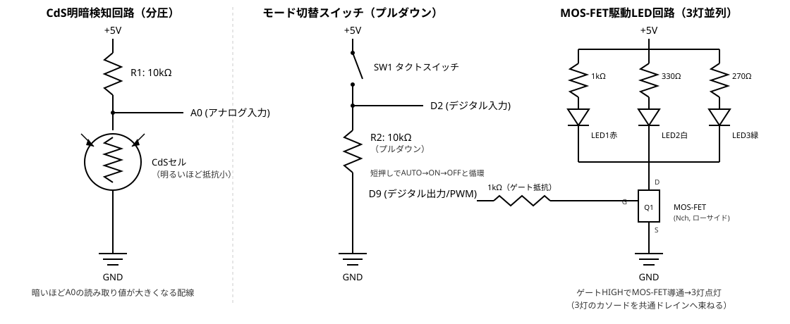
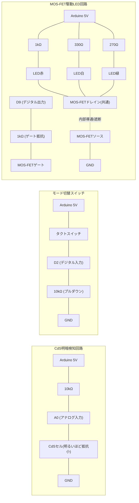
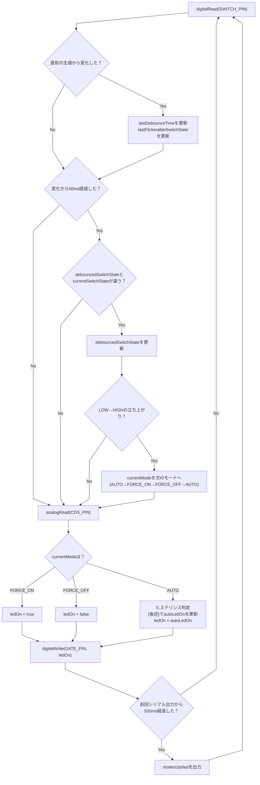
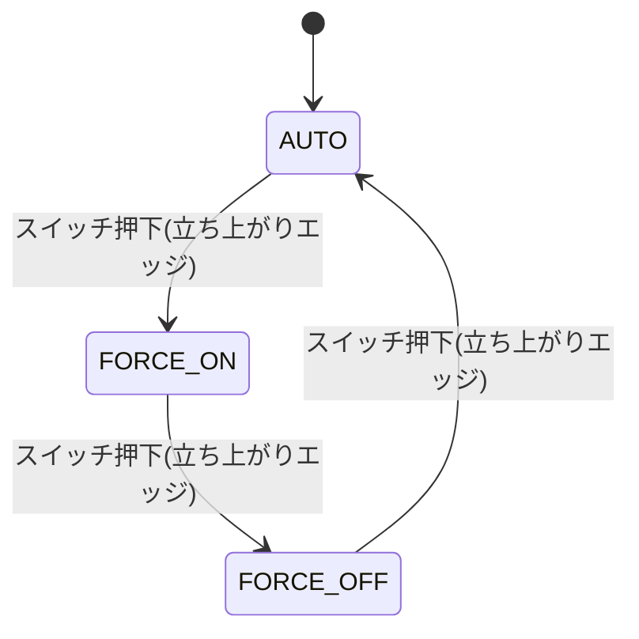
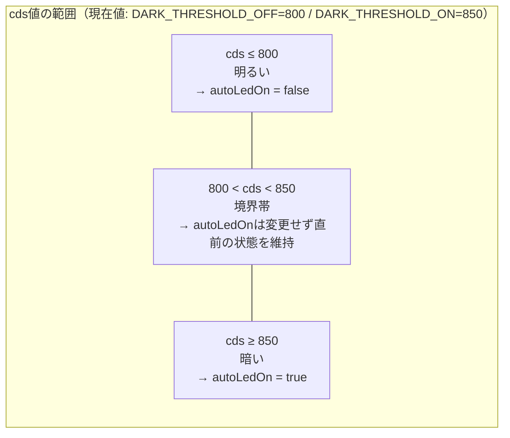
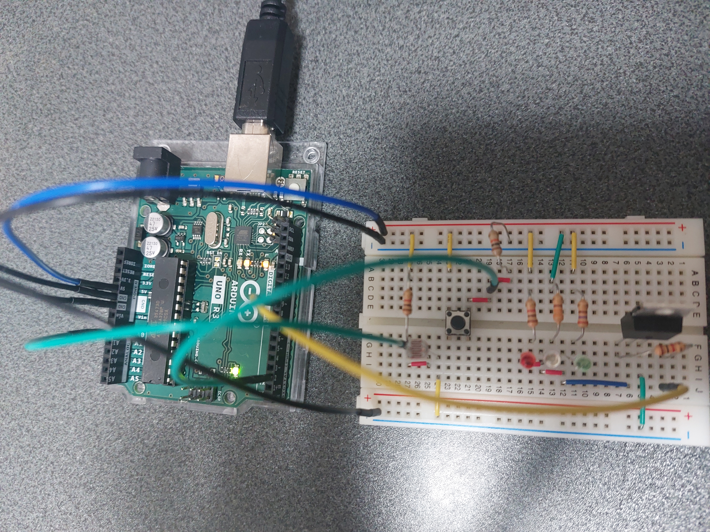

# プログラム③ 明暗検知ナイトライト（お任せ企画）

初めて読む場合は、先に[入門ガイド（用語解説）](../../docs/beginner_guide.md)に目を通すことを推奨します。

## 概要

「お任せ」の位置づけとして、②までで未使用だったCdSセル・MOS-FET・LED（白・緑）を使い、周囲が暗くなると自動でLEDが点灯する簡易ナイトライトを製作する。タクトスイッチで動作モードを「自動／常時点灯／消灯」の3状態に切り替えられるようにし、②で実証済みの時間ベースデバウンス処理を流用する。

方針は事前にユーザーへ提案し確認済み（2026-08-30）:

- CdS＋MOS-FETを軸にした明暗検知ナイトライトの方向で進める（承認）。
- キット付属のダイオードは、③では**使用しない**（承認）。理由は「ダイオードの扱い」参照。

## 電気工作

配線・ブレッドボード組み立てはユーザーが行う。以下はClaudeが作成した回路設計。

### 使用部品

| 部品 | 数量 | 備考 |
|---|---|---|
| CdSセル | 1個 | キット付属。①②では未使用 |
| CdS用抵抗（分圧） | 1本（10kΩ、茶黒橙金） | ②のスイッチ用と対になっているもう1本を使用 |
| タクトスイッチ | 1個 | ②と共用（モード切替用に再配線） |
| タクトスイッチ用抵抗（プルダウン） | 1本（10kΩ、茶黒橙金） | ②で使用した実績のある構成を流用 |
| MOS-FET | 1個 | キット付属、IRF520（現物刻印で確認済み、2026-08-30）。①②では未使用。詳細は「MOS-FETの型番について」参照 |
| ゲート抵抗 | 1本（1kΩ、茶黒赤金） | ゲート容量への突入電流を抑える直列抵抗 |
| LED（赤色） | 1個 | ②と同一色を再配線して使用 |
| LED（白色） | 1個 | キット付属3色のうち①②では未使用 |
| LED（緑色） | 1個 | キット付属3色のうち①②では未使用 |
| LED用抵抗（赤用） | 1本（1kΩ、茶黒赤金） | ②と同じ選定根拠 |
| LED用抵抗（白用） | 1本（330Ω、橙橙茶金） | ①②では未使用。電圧電流計算は後述 |
| LED用抵抗（緑用） | 1本（270Ω、赤紫茶金） | ①②では未使用。電圧電流計算は後述 |
| ダイオード | 0個（不使用） | 「ダイオードの扱い」参照 |

キット付属の抵抗（10kΩ×2、1kΩ×3、330Ω×1、270Ω×1）をちょうど使い切る配分になっている。

### ピン割り当て

| ピン | 用途 |
|---|---|
| A0 | CdS分圧回路のアナログ入力 |
| D2 | モード切替スイッチのデジタル入力 |
| D9 | MOS-FETゲート駆動のデジタル出力（PWM対応ピンを割り当てたが、現行実装ではON/OFFのみに使用） |

### 回路図

第一候補のSVG（回路記号形式）で作成し、ヘッドレスブラウザでのレンダリングにより視認性確認済み（2026-08-30）。あわせてmermaid版も残す（方針は[プロジェクトCLAUDE.md](../../CLAUDE.md)参照）。

- CdS回路: 5V → 10kΩ → A0（分岐） → CdSセル → GND の分圧。**CdSは明るいほど抵抗値が下がる**ため、この配線では**暗いほどA0の読み取り値が大きくなる**。
- スイッチ回路: ②と同じプルダウン方式。押していないときD2はLOW、押しているときHIGH。短押しのたびにモードが AUTO→FORCE_ON→FORCE_OFF→AUTO と循環する。
- LED駆動回路: 赤・白・緑のLED3個を、それぞれ個別の電流制限抵抗を介して5Vラインから並列に配線し、共通のカソード側をMOS-FETのドレインにまとめてローサイドスイッチとする。ゲート（D9）をHIGHにするとMOS-FETが導通し3灯とも点灯、LOWで3灯とも消灯する。

#### SVG版（第一候補）

ヘッドレスブラウザでのレンダリングにより視認性確認済み（2026-08-30）。



ファイル: `programs/03_night_light/circuit_diagram.svg`

MOS-FETは正式な回路記号（3端子の物理構造を表す記号）を手描きすると座標調整コストが大きいため、G/D/Sのピン表記を付けた簡略化した四角形記号で代替した（②で確認したSVG手描きのコスト特性を踏まえた判断）。

#### mermaid版（補助）



### MOS-FETの型番について（2026-08-30、現物確認により確定）

現物のパッケージ刻印を確認したところ「IRF520 N17K AG」であることが判明した（IRF520が型番、他はロット・製造コードと見られる）。IRF520は広く使われている一般的なTO-220パッケージのNチャネル・パワーMOS-FETで、以下の一般的に公知の特性を踏まえると本回路の駆動方法で問題ない。

- Nチャネル・エンハンスメント型
- ゲートしきい値電圧 Vgs(th) は概ね2〜4V程度（一般的な仕様として公知の範囲）。ArduinoのゲートHIGH（5V）駆動はこの範囲を上回るため確実に導通する。Rds(on)の定格値は一般的により高いゲート電圧（10V等）を前提に測定されており、5V駆動時のRds(on)はそれより高くなるが、本回路が扱うのは3灯合計でも約20mA程度と極めて小さい電流のため実用上まったく問題にならない。
- ドレイン電流定格は数A〜10A級（一般的な仕様として公知の範囲）であり、本回路の約20mAに対して十分すぎる安全マージンがある。

**TO-220パッケージのピン配置（刻印面を正面にして脚を下に向けたとき、左からG・D・S）**は、Vishay公式データシート（`IRF520-datasheet.pdf`、Document Number: 91017、S21-0819-Rev. C）1ページ目のパッケージ外観図（G/D/Sのラベル付き）で確認済み（2026-08-30）。同ファイルは著作権配慮のためGit管理対象外・ローカルのみで保持（`A000066-datasheet.pdf`と同様の扱い、[プロジェクトCLAUDE.md](../../CLAUDE.md)参照）。特にG（ゲート）とD/S（ドレイン/ソース）を取り違えるとMOS-FETが正しく導通/遮断せずLEDが常時薄く点灯する等の誤動作につながるため、配線後の動作確認（後述の「ビルド・書き込み・動作確認手順」）で必ず挙動を確かめること。

### MOS-FETの効果（回路設計上の役割）

MOS-FETのゲートは絶縁構造のため、定常状態ではゲート電流がほぼゼロで、Vgs(th)を超える電圧をかけるだけでドレイン-ソース間を導通させられる（電圧制御スイッチ）。ベース電流を常時必要とするバイポーラトランジスタ（BJT）とはこの点が異なり、本回路では以下の効果を狙ってMOS-FETを採用した。

1. **GPIOピンの電流負担の切り離し**: 赤・白・緑LED3灯の合計電流（最悪値約20.4mA、「電圧・電流計算」参照）は、Arduinoデジタルピン1本の推奨上限（20mA）に近く、GPIOから直接3灯を駆動するのは推奨範囲を超えるおそれがある。MOS-FETをローサイドスイッチにしたことで、LEDの電流経路は「5Vライン → LED → MOS-FETドレイン → ソース → GND」となり、GPIO（D9）はゲートに電圧をかけるだけで済む。ゲート抵抗1kΩ経由の過渡電流も最大5mA程度で、GPIOの許容範囲に十分収まる。
2. **GPIOピン数の節約**: 3色のLEDは常に同時にON/OFFする仕様（色ごとの個別制御はない）のため、3灯の共通カソードをMOS-FET1個にまとめ、GPIO1本（D9）だけで全灯を制御できる。MOS-FETを使わずGPIO直結にする場合、電流分散のためLEDごとに別ピンが必要になっていた可能性がある。
3. **将来の拡張余地**: D9はPWM対応ピンとして割り当て済みだが、現行実装では`digitalWrite`のHIGH/LOWのみを使用している。MOS-FETは機械的接点を持たず高速スイッチング（kHzオーダー）が可能なため、将来`analogWrite()`に変更するだけで調光（フェードイン/アウト等）に対応できる余地がある。リレーではこの用途は現実的でない（機械寿命・動作音の制約があるため）。

パラメータ面では、Vgs(th)（概ね2〜4V）に対しArduinoの5V HIGH出力は確実に上回るため導通は保証される。Rds(on)は5V駆動だと定格値（多くは10V基準で測定）より高くなるが、本回路が扱う電流は20.4mAと極小のため電圧降下・発熱は実用上無視できる。ドレイン電流定格（数A〜10A級）に対しても実負荷は桁違いに小さく、故障マージンは大きい。

なお現状のLEDは抵抗性負荷のためMOS-FET自体にフライバック保護（ダイオード）は不要だが（「ダイオードの扱い」参照）、将来モーター等の誘導性負荷を追加する場合も同じ「GPIO1本＋MOS-FETのローサイドスイッチ」構成を流用でき、その際はダイオードを追加するだけで拡張できる設計になっている。

### 電圧・電流計算（オームの法則）

**LED駆動回路（MOS-FET導通時、Vds_onによる電圧降下は数十mV程度で無視できるほど小さいため保守的に0と仮定。実際の電流は計算値よりわずかに小さくなる方向のみに働くため安全側の見積もりとなる）**

| LED | 抵抗 | 順方向電圧Vfの想定範囲 | 電流 I = (5V−Vf)/R |
|---|---|---|---|
| 赤 | 1kΩ | 1.8〜2.2V（②と同じ一般値の見積もり） | 2.8〜3.2mA |
| 白 | 330Ω | 3.0〜3.4V（高輝度白色LEDの一般的な範囲） | 4.8〜6.1mA |
| 緑 | 270Ω | 2.0〜3.4V（GaP系〜InGaN系まで型不明のため広めに見積もり） | 5.9〜11.1mA |

3灯合計電流の最悪値: 約3.2 + 6.1 + 11.1 ≈ **20.4mA**。これはデジタルピン1本の推奨上限電流（20mA）に近い値であり、**Arduinoピンから直接3灯を駆動するのは推奨範囲を超えるおそれがある**。これがMOS-FETをローサイドスイッチとして用い、LED側の電流をArduinoピンではなく5Vラインから直接取る構成にした理由である。MOS-FETのドレイン電流としては、一般的な小信号MOS-FET（連続定格数百mA程度）に対し20.4mAは十分小さく安全マージンは大きい。

**CdS分圧回路**

- CdSセルの抵抗値は明るさにより大きく変化する（一般的な特性として明所で数kΩ、暗所で数百kΩ〜MΩのオーダー）。
- 分圧回路の電流 I = 5V / (R1 + Rcds) は、明所（Rcds小）でも I ≈ 5V/11kΩ ≈ 0.45mA程度、暗所（Rcds大）ではさらに小さくなり、いずれも消費電流として問題ない範囲。

**スイッチ回路（プルダウン抵抗）**

- ②と同じ構成: 押下時の電流 I = 5V / 10kΩ = 0.5mA。

**ゲート駆動**

- MOS-FETのゲートは定常時は電流をほとんど消費しない（入力容量への充放電時のみ過渡的に流れる）。ゲート抵抗1kΩによる過渡最大電流は 5V/1kΩ = 5mA程度で、Arduinoピンの許容範囲内。本設計はON/OFFの低速な切り替えのみのため、ゲート容量の充放電速度は問題にならない。

## ダイオードの扱い

MOS-FET＋ダイオードの定番の組み合わせは、モーターやリレーなど**誘導性負荷**を駆動する際のフライバック（逆起電力保護）用途だが、本キットにはモーターが含まれていない。LEDは誘導性負荷ではないため、フライバック保護としてのダイオードは技術的に不要と判断した。ユーザー確認の上（2026-08-30）、③ではダイオードを使用せず、将来モーター等の誘導性負荷を追加する際の用途として保留することとした。

## 動作仕様

- 起動時のモードは `AUTO`（自動点灯モード）。
- `D2`（モード切替スイッチ）を短押しするたびに `AUTO → FORCE_ON（常時点灯） → FORCE_OFF（常時消灯） → AUTO …` と循環する。スイッチ判定は②で実測検証済みの時間ベースデバウンス（50ms）を流用。
- `AUTO`モードでは、CdSの読み取り値（`A0`、暗いほど大きい値）が閾値を超えたら点灯、下回ったら消灯する。閾値には二段構え（ヒステリシス）を設け、境界付近での点滅を防止する（`DARK_THRESHOLD_ON=600` で点灯、`DARK_THRESHOLD_OFF=500` で消灯。中間の値では直前の状態を保持）。
- LED点灯/消灯は`D9`（MOS-FETゲート）のHIGH/LOWで制御する。
- 約500msごとに現在のモード・CdS読み取り値・LED状態をシリアル出力する（①の実績を踏襲し9600bps）。

### 閾値の実機調整について

`DARK_THRESHOLD_ON` / `DARK_THRESHOLD_OFF` はCdSセルの個体差・設置環境の明るさに依存するため、コード中に定数として用意し、実機でのシリアル出力（`cds=...`）を確認しながら調整する運用とする。②のチャタリング検証と同様、実測を伴う調整が必要になった場合は改めて計測・記録する。

## プログラム設計

`src/main.cpp` の実装レベルの設計。上記「動作仕様」がユーザーから見た挙動の説明であるのに対し、ここでは`loop()`内部の処理順序・状態管理・判定ロジックを扱う。

### 処理フロー（`loop()`関数）

`loop()`は毎周回、以下の順序で「スイッチ判定 → CdS判定 → 出力」を行う非ブロッキング構成（`delay()`を使わない）。②のデバウンス実装と同じく、時間経過はすべて`micros()`/`millis()`の差分比較で判定する。



ポイント:

- スイッチ判定とCdS判定・LED出力を同じ周回内で行うため、モード切替の反応とLED制御の反応はどちらも数msオーダーで、体感上ほぼ同時に反映される。
- デバウンス確定待ち（`D`が"No"の分岐）や立ち上がりでない場合（`G`が"No"の分岐）でも、CdS判定とLED出力（`H`以降）は毎周回必ず実行される。スイッチの状態確定を待つ間もAUTOモードの明暗追従は止まらない。

### モード状態遷移

3モードは`enum Mode`の値を`(currentMode + 1) % MODE_COUNT`で巡回させているだけなので、順序は列挙順（`MODE_AUTO=0, MODE_FORCE_ON=1, MODE_FORCE_OFF=2`）に固定される。遷移が起きるのは、デバウンス確定後の状態が LOW→HIGH に変化した瞬間（押下エッジ）のみで、離す動作や押しっぱなしでは遷移しない。



### スイッチのデバウンスロジック

②で実測検証済みの時間ベースデバウンス（`chatter_measurement.cpp`、約1msの間に生信号が2回反転する事例を確認）をそのまま流用している。3つの変数の役割は以下の通り。

| 変数 | 役割 |
|---|---|
| `lastFlickerableSwitchState` | 直近の生の`digitalRead`値。この値が変化するたびに`lastDebounceTime`をリセットし、チャタリング中は確定処理に進ませない |
| `lastDebounceTime` | 生値が最後に変化した時刻（`micros()`）。ここから`DEBOUNCE_DELAY_US`(50ms)経過するまでは「まだ確定していない」とみなす |
| `debouncedSwitchState` | チャタリング収束後に確定した状態。この値が変化した回（かつLOW→HIGHの立ち上がり）だけモードを進める |

`debouncedSwitchState`の変化判定と立ち上がり判定を分けているのは、離すとき（HIGH→LOW）にモードが進んでしまわないようにするため。1回の物理的な押下につきモードは1段階だけ進む。

### AUTOモードのヒステリシス判定ロジック

`cdsValue`（暗いほど大きい値）を2つの閾値と比較し、`autoLedOn`（前回の点灯/消灯状態を保持する変数）を更新する。



境界帯（801〜849）では`if`/`else if`のどちらの条件にも一致しないため代入文が実行されず、`autoLedOn`は直前周回の値のまま保持される。これにより、CdS値が2つの閾値の間で微小に揺れても、その揺れだけではLEDのON/OFFが切り替わらない（点滅防止）。閾値の実測・調整経緯は前述「閾値の実機調整について」および「動作確認結果」参照。

### 定数・グローバル変数一覧

| 名前 | 種別 | 役割 |
|---|---|---|
| `BAUD_RATE` | 定数 | シリアル通信速度（①の実績を踏襲し9600） |
| `SWITCH_PIN` / `GATE_PIN` / `CDS_PIN` | 定数 | ピン割り当て（詳細は「ピン割り当て」表） |
| `DEBOUNCE_DELAY_US` | 定数 | デバウンス確定までの待ち時間（50ms、②の実測に基づく） |
| `DARK_THRESHOLD_ON` / `DARK_THRESHOLD_OFF` | 定数 | AUTOモードのヒステリシス閾値（実機調整値） |
| `STATUS_INTERVAL_MS` | 定数 | シリアル定期出力の間隔（500ms） |
| `currentMode` | グローバル変数 | 現在のモード（`AUTO`/`FORCE_ON`/`FORCE_OFF`） |
| `autoLedOn` | グローバル変数 | AUTOモードでのヒステリシス判定結果（前回状態の保持用） |
| `lastFlickerableSwitchState` / `debouncedSwitchState` / `lastDebounceTime` | グローバル変数 | デバウンス処理用（役割は上表参照） |
| `lastStatusTime` | グローバル変数 | 前回シリアル出力時刻（`millis()`）。500ms周期の管理に使用 |

## ファイル構成

```
programs/03_night_light/
├── README.md              本ドキュメント
├── platformio.ini         PlatformIO設定（環境: uno）
├── src/main.cpp            本体プログラム
├── circuit_diagram.svg     回路図（手描きSVG・第一候補）
└── image/circuit_photo.jpg 実機写真（公開用に選定した1枚。他の撮影分はローカル保持のみ）
```

## ビルド・書き込み・動作確認手順

前提: VS Code + PlatformIO IDE拡張機能がインストール済みであること。回路設計（部品・ピン割り当て・電圧電流計算）は上記「電気工作」参照。実際の配線・ブレッドボード組み立てはユーザーが行う。**MOS-FETはG/D/Sのピン配置を取り違えないよう「MOS-FETの型番について」の記載を確認した上で配線すること。**

1. 上記回路設計に沿って配線する。
2. VS Code で `programs/03_night_light/` フォルダを開く（PlatformIOプロジェクトとして認識される）。
3. Arduino Uno をUSBケーブルでPCに接続する。
4. PlatformIOのUploadボタン（→アイコン）でビルド・書き込みを実行する。
   - CLIの場合: `pio run --target upload`
5. シリアルモニタ（9600bps）で `mode=... cds=... led=...` の出力を確認しながら、以下を確認する。
   - 部屋を暗くする（またはCdSセルを手で覆う）とAUTOモードで自動点灯すること
   - 明るくすると自動消灯すること
   - スイッチを短押しするたびにモードが循環すること（FORCE_ONで常時点灯、FORCE_OFFで常時消灯）
   - 観察した`cds`値をもとに、必要であれば`DARK_THRESHOLD_ON`/`DARK_THRESHOLD_OFF`を調整する

## 接続ポートについて

`platformio.ini` の `upload_port` は、①②での動作確認時の実績（COM3）を暫定値として設定している。USBポートの差し替えやPC再起動などによりCOM番号が変わった場合は、実際のポート番号に書き換える必要がある（確認方法: `pio device list`）。

## 動作確認結果

- ビルド確認済み（2026-08-30、`pio run`でコンパイル成功。RAM使用12.4%、Flash使用8.7%）。
- 実機での動作確認済み（2026-08-30）。当初LEDが点灯しない不具合があり切り分けたところ、LED自体のショートが原因と判明（回路設計・プログラムのロジックには問題なし）。LED交換等の物理的な対応後、正常動作を確認した。
- AUTOモードでLEDが常時点灯したままになる不具合を確認（2026-08-30）。実測したCdS値（室内照明の消灯≈900超／点灯≈700〜800）と`DARK_THRESHOLD_ON=600`/`DARK_THRESHOLD_OFF=500`を照らし合わせたところ、点灯時の値ですら閾値を上回ってしまい常に暗いと誤判定していたことが判明。実測値を踏まえ`DARK_THRESHOLD_ON=850`/`DARK_THRESHOLD_OFF=800`に調整した。点灯側の値には幅があるため、この新しい閾値でチャタリング的な誤点滅がないかの実機再確認は未実施（ユーザーによる確認待ち）。

### 実機写真



### 実機写真からの電気工作改善点（2026-08-30）

実際に組んだ回路の写真を解析した結果、動作自体は上記の通り正常だが、以下の点は今後の配線改善の余地がある。

- **LED・抵抗クラスタのリード線密集**: 赤・白・緑LEDと各電流制限抵抗が並ぶ箇所で、複数のベアリード線（被覆なしの金属脚）がかなり接近・交差している。既にLED自体のショートで1回不具合が発生した実績のある箇所でもあるため、動作確認後にリードを短くトリミングする、部品間に1列分の余裕を空けるなど、隣接リード同士が触れない配置にすると再発防止になる。
- **CdS分圧ノードがブレッドボード中央の溝を抵抗のリード線だけでまたいでいる**: 10kΩ抵抗の片脚が長く曲げられ、ブレッドボード中央の谷（A-EブロックとF-Jブロックの間）をまたいでCdS・A0配線の合流点まで伸びている。電気的には問題ないが、宙に浮いた長いリードは接触不良を起こしやすいため、短いジャンパー線に置き換えるか奥まで確実に差し込まれているか再確認すると安定性が上がる。
- **CdSセルが遮光されていない**: 上記の通り室内照明の点灯/消灯でCdS実測値にばらつきがあり閾値調整が必要になった。CdSが完全にむき出しのため、周囲の物や手の影で読み取り値が変わりやすい。今後さらに閾値を追い込む場合は、CdS周りに紙筒や黒いチューブ等の簡易的な遮光カバーを付けると外乱光によるばらつきを抑えられる。
- **ジャンパー線がICSPヘッダーの上を横切っている**: ICSPピン自体には何も接続されておらず実害はないが、被覆付きジャンパー線がICSPの露出ピンのすぐ上を横切るルートになっている。抜き差しの際に引っかけてピンを曲げたり誤接触したりするのを避けるため、ICSPヘッダーを避けるルートに配線し直すのが望ましい。

良かった点として、内部配線に短い絶縁被覆ジャンパー（赤スリーブ）を使いむき出し配線同士の接触を避ける工夫が見られること、MOS-FETが型番・ピン配置ともにデータシート通りの向きで実装されていること、Arduino本体がアクリルケースに収まり机との接触によるショートの心配がないことが確認できた。
